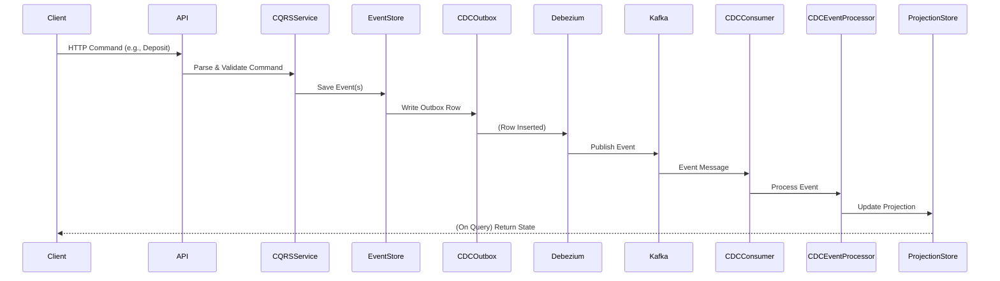
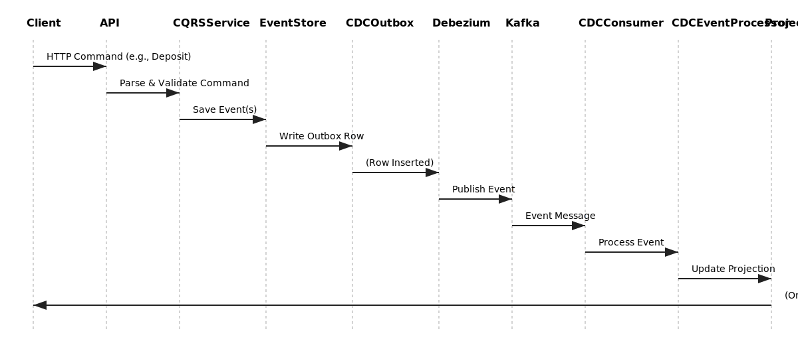

# CDC Debezium Pipeline: Step-by-Step Guide

This document describes the **full pipeline for the CDC Debezium path** in the banking CQRS/Event Sourcing system.

---

## 1. HTTP Request → Command Handler

- **User** sends a command (e.g., deposit) to a CQRS endpoint (`/api/cqrs/accounts/{id}/deposit`).
- **Axum** routes the request to the handler.
- The handler calls the **CQRSAccountService** to process the command.

---

## 2. Command Processing & Event Generation

- The service:
  - Loads the aggregate (account) from the **Event Store**.
  - Applies business logic.
  - **Generates domain events** (e.g., `MoneyDeposited`).
- Calls the **Event Store** to persist these events.

---

## 3. Event Store: Persisting Events

- The **Event Store**:
  - Serializes and saves events to the `events` table.
  - **Writes a message to the outbox table** (`kafka_outbox_cdc`) via the **CDCOutboxRepository**.

---

## 4. CDC Outbox Table

- The new row in `kafka_outbox_cdc` contains:
  - Event data, type, aggregate ID, etc.

---

## 5. Debezium Monitors Outbox Table

- **Debezium** (external process) is configured to watch the `kafka_outbox_cdc` table.
- When a new row is inserted:
  - Debezium **captures the change**.
  - **Publishes a message to Kafka** (topic: `banking-es.public.kafka_outbox_cdc`).

---

## 6. Kafka: CDC Topic

- The event is now in the Kafka topic.
- Your app’s **CDCConsumer** subscribes to this topic.

---

## 7. CDCConsumer Receives Event

- The **CDCConsumer** (see `cdc_debezium.rs`) receives the Kafka message.
- Passes the event to the **CDCEventProcessor** (specifically, the `UltraOptimizedCDCEventProcessor`).

---

## 8. CDCEventProcessor: Event Handling

- The processor:
  - Validates the event (business rules, duplicate detection, etc.).
  - Adds it to a **batch queue**.

---

## 9. Batch Processor: Projection Update

- The batch processor:
  - Groups events by aggregate.
  - Loads or updates the **projection** (read model) for each aggregate.
  - Applies all events to the projection.
  - Writes the updated projection to the **projections table** (and possibly cache/Redis).

---

## 10. Read Model is Updated

- The **projection** is now up-to-date.
- Clients can query the latest state via CQRS read endpoints.

---

## 11. (Optional) Cache/Redis Update

- The updated projection may also be cached in **Redis** for fast access.
- Cache invalidation messages may be sent via Kafka to keep distributed caches in sync.

---

## 12. Monitoring, Logging, and Metrics

- Throughout the pipeline:
  - **Logging** and **metrics** are recorded (e.g., events processed, failures, latency).
  - Health checks and dashboards monitor the system.

---

## Summary Table

| Step | Component         | File/Module                             | What Happens                         |
| ---- | ----------------- | --------------------------------------- | ------------------------------------ |
| 1    | HTTP Handler      | `web/cqrs_routes.rs`                    | Receives command, calls CQRS service |
| 2    | CQRS Service      | `application/services.rs`               | Validates, generates events          |
| 3    | Event Store       | `infrastructure/event_store.rs`         | Persists events, writes to outbox    |
| 4    | CDC Outbox Repo   | `infrastructure/cdc_debezium.rs`        | Inserts row in `kafka_outbox_cdc`    |
| 5    | Debezium          | (external, configured via JSON)         | Captures row, publishes to Kafka     |
| 6    | Kafka             | (external)                              | Holds event message                  |
| 7    | CDCConsumer       | `infrastructure/cdc_debezium.rs`        | Receives Kafka message               |
| 8    | CDCEventProcessor | `infrastructure/cdc_event_processor.rs` | Validates, batches event             |
| 9    | Batch Processor   | `infrastructure/cdc_event_processor.rs` | Updates projection/read model        |
| 10   | Projection Store  | `infrastructure/projections.rs`         | Read model is up-to-date             |

---

## Visual Flow (CDC Debezium Path)



---

## Notes

- **Debezium** is an external process and must be configured to watch the outbox table and publish to Kafka.
- **CDCConsumer** and **CDCEventProcessor** are part of your Rust application.
- **Projections** are the read models that power fast queries.
- **Redis** is optional for caching projections.

---

_Last updated: 2024-06_

```svg
<svg width="1000" height="600" viewBox="0 0 1000 600" xmlns="http://www.w3.org/2000/svg">
  <style>
    .actor { font: bold 16px sans-serif; }
    .msg { font: 14px sans-serif; }
    .arrow { stroke: #222; stroke-width: 2; marker-end: url(#arrowhead); }
    .lifeline { stroke: #aaa; stroke-dasharray: 4 4; }
    .box { fill: #f4f4f4; stroke: #bbb; }
  </style>
  <defs>
    <marker id="arrowhead" markerWidth="10" markerHeight="7" refX="10" refY="3.5" orient="auto">
      <polygon points="0 0, 10 3.5, 0 7" fill="#222"/>
    </marker>
  </defs>
  <!-- Actors -->
  <g>
    <text x="50" y="40" class="actor">Client</text>
    <text x="150" y="40" class="actor">API</text>
    <text x="250" y="40" class="actor">CQRSService</text>
    <text x="370" y="40" class="actor">EventStore</text>
    <text x="500" y="40" class="actor">CDCOutbox</text>
    <text x="630" y="40" class="actor">Debezium</text>
    <text x="740" y="40" class="actor">Kafka</text>
    <text x="830" y="40" class="actor">CDCConsumer</text>
    <text x="950" y="40" class="actor">CDCEventProcessor</text>
    <text x="1100" y="40" class="actor">ProjectionStore</text>
  </g>
  <!-- Lifelines -->
  <g>
    <line x1="60" x2="60" y1="60" y2="540" class="lifeline"/>
    <line x1="160" x2="160" y1="60" y2="540" class="lifeline"/>
    <line x1="260" x2="260" y1="60" y2="540" class="lifeline"/>
    <line x1="380" x2="380" y1="60" y2="540" class="lifeline"/>
    <line x1="510" x2="510" y1="60" y2="540" class="lifeline"/>
    <line x1="640" x2="640" y1="60" y2="540" class="lifeline"/>
    <line x1="750" x2="750" y1="60" y2="540" class="lifeline"/>
    <line x1="840" x2="840" y1="60" y2="540" class="lifeline"/>
    <line x1="960" x2="960" y1="60" y2="540" class="lifeline"/>
    <line x1="1110" x2="1110" y1="60" y2="540" class="lifeline"/>
  </g>
  <!-- Messages -->
  <g>
    <text x="80" y="90" class="msg">HTTP Command (e.g., Deposit)</text>
    <line x1="60" y1="100" x2="160" y2="100" class="arrow"/>
    <text x="180" y="130" class="msg">Parse & Validate Command</text>
    <line x1="160" y1="140" x2="260" y2="140" class="arrow"/>
    <text x="280" y="170" class="msg">Save Event(s)</text>
    <line x1="260" y1="180" x2="380" y2="180" class="arrow"/>
    <text x="400" y="210" class="msg">Write Outbox Row</text>
    <line x1="380" y1="220" x2="510" y2="220" class="arrow"/>
    <text x="530" y="250" class="msg">(Row Inserted)</text>
    <line x1="510" y1="260" x2="640" y2="260" class="arrow"/>
    <text x="660" y="290" class="msg">Publish Event</text>
    <line x1="640" y1="300" x2="750" y2="300" class="arrow"/>
    <text x="770" y="330" class="msg">Event Message</text>
    <line x1="750" y1="340" x2="840" y2="340" class="arrow"/>
    <text x="860" y="370" class="msg">Process Event</text>
    <line x1="840" y1="380" x2="960" y2="380" class="arrow"/>
    <text x="980" y="410" class="msg">Update Projection</text>
    <line x1="960" y1="420" x2="1110" y2="420" class="arrow"/>
    <text x="1130" y="450" class="msg">(On Query) Return State</text>
    <line x1="1110" y1="460" x2="60" y2="460" class="arrow"/>
  </g>
</svg>
```

---

### **How to use:**

- Copy the SVG code above and save it as a file (e.g., `cdc_debezium_pipeline.svg`).
- Reference it in your markdown:
  ```markdown
  
  ```
- You can also open the SVG file in any browser or image viewer.

---

**If you want the SVG file generated and placed in your repo, let me know!**
